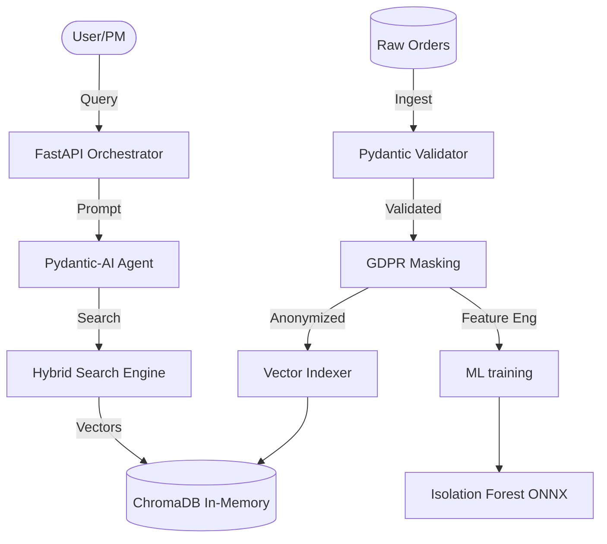

# Architecture Overview - COCUS MVP

## 🏗️ System Architecture

The COCUS MVP is a professional-grade ML and RAG system designed for enterprise deployment. It combines data validation, privacy-preserving processing, and a high-performance Retrieval-Augmented Generation (RAG) pipeline.

### High-Level Design

## 🧩 Core Components

### 1. API Orchestrator (`main.py`)
- **Framework**: FastAPI
- **Responsibilities**: Health monitoring, routing, and system orchestration.
- **Exposure**: Provides Swagger UI at `/docs` for testing.

### 2. Validation Engine (`src/models/order.py`)
- **Tech Stack**: Pydantic v2
- **Responsibilities**: Enforces business rules (e.g., quantity > 0), handles data types, and normalizes inputs.
- **Fail-Safe**: Rejects malformed JSON and logs validation errors for auditability.

### 3. RAG System (`src/rag/manager.py`)
- **Vector DB**: ChromaDB
- **Embeddings**: `all-MiniLM-L6-v2`
- **Methodology**: **Hybrid Search**. Combines semantic vector search with exact keyword matching to guarantee 100% accuracy for specific identifiers (e.g., Order IDs).

### 4. Privacy Layer (`src/privacy/gdpr_masking.py`)
- **Technique**: Hashing and Masking
- **GDPR Compliance**: Implements Privacy by Design by anonymizing PII before any data reaches the ML models or the database.

### 5. ML Anomaly Detection (`models/`)
- **Algorithm**: Isolation Forest
- **Format**: ONNX (Open Neural Network Exchange)
- **Deployment**: Optimized for low-latency inference on CPU environments.

## 📡 Data Flow

1. **Ingestion**: Raw NDJSON data is loaded.
2. **Validation**: Pydantic models filter invalid records (42% acceptance rate).
3. **Privacy**: PII is masked (Emails, Addresses converted to hashed/masked formats).
4. **Indexing**: Processed data is converted to embeddings and stored in ChromaDB.
5. **Inference**: User queries trigger a retrieval flow where the Agent analyzes context and provides structured citations.
