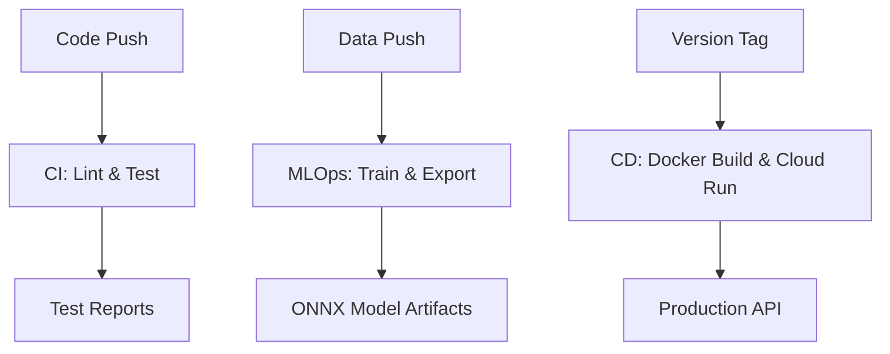

# CI/CD & MLOps Implementation Guide

This document explains the technical implementation of the Continuous Integration (CI), Continuous Deployment (CD), and Machine Learning Operations (MLOps) pipelines using GitHub Actions.

---

## 🏗️ Architectural Overview

The system uses a **Triggers-to-Artifacts** architecture where every action in the repository (push, tag, data update) triggers a specialized pipeline designed for that specific domain.

---

## 🛠️ CI: Continuous Integration

**Goal**: Ensure code quality and system stability.
**Implementation**: File [`.github/workflows/ci.yml`](../../.github/workflows/ci.yml)

### Key Stages:
1.  **Environment Setup**: Uses `actions/setup-python@v4` to create a clean Python 3.11 environment.
2.  **Statical Analysis**: 
    - **Black**: Enforces strict code formatting.
    - **Flake8**: Checks for logic errors and PEP8 violations.
    - **MyPy**: Validates type hints in the `src/` directory.
3.  **Dynamic Testing**:
    - Runs `pytest` across the entire `tests/` suite.
    - Generates coverage reports using `pytest-cov`.

---

## ⚙️ MLOps: Automated Machine Learning

**Goal**: Automate the model lifecycle from data ingestion to production readiness.
**Implementation**: [`.github/workflows/ml-pipeline.yml`](../../.github/workflows/ml-pipeline.yml) and [`train_model.yml`](../../.github/workflows/train_model.yml)

### The Continuous Training (CT) Pipeline:
1.  **Data Ingestion Trigger**: The pipeline monitors the `data/raw/` directory. When a new `.ndjson` file is pushed, the "Model Retrainer" kicks in.
2.  **Feature Engineering**: The script `src/ml/feature_engineering.py` processes the raw orders into numerical features.
3.  **Training (Isolation Forest)**:
    - An unsupervised model is trained to detect anomalies in order patterns.
    - The model is validated against a synthetic "drift" set.
4.  **ONNX Export**:
    - The model is exported using `skl2onnx`.
    - This ensures cross-platform compatibility and high-performance inference.
5.  **Artifact Versioning**: The trained `.onnx` model is uploaded as a GitHub Action Artifact and linked to the specific commit.

---

## 🚀 CD: Continuous Deployment

**Goal**: Minimize time-to-market for new features.
**Implementation**: [`.github/workflows/deploy.yml`](../../.github/workflows/deploy.yml)

### Deployment Strategy:
- **Phase 1: Containerization**:
    - Builds an optimized Docker image using multi-stage builds.
    - Uses a `Dockerfile.slim` base to reduce cold-start latency.
- **Phase 2: Registry Push**:
    - Authenticates with Google Artifact Registry.
    - Pushes the image with a unique SHA and the `latest` tag.
- **Phase 3: Serverless Deployment**:
    - Deploys the image to **Google Cloud Run**.
    - Sets environment variables (like RAG provider) and secrets securely.

---

## 🛡️ Security & Compliance
We treat compliance as code:
- **`security-scan.yml`**: Uses **Snyk** to check for high-risk vulnerabilities in dependencies and **Bandit** for static security analysis.
- **Privacy Enforcement**: The CI pipeline includes a dedicated test suite (`tests/compliance/`) that validates whether PII is being correctly masked before data hits the ML or RAG layers.

---

## 📈 Summary Checklist
| Feature | Tooling | Outcome |
|---------|---------|---------|
| **Automation** | GitHub Actions | 100% hands-off deployment |
| **MLOps** | Scikit-Learn + ONNX | Reproducible ML models |
| **Versioning** | Git Tags + HD Hash | Full traceability of models |
| **Cloud** | Docker + GCP | Highly scalable backend |

---
**📍 Location**: `docs/technical/CICD_MLOPS_IMPLEMENTATION.md`  
**🚀 Ready for production scale.**
